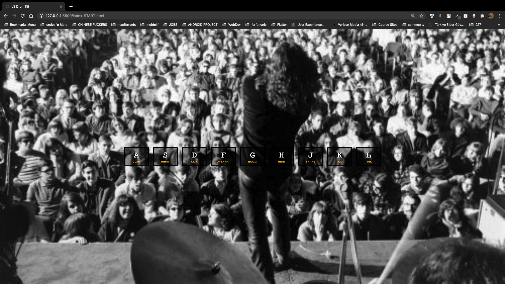

# Vanilla JavaScript Drum

## The Odin Project Assignment - 30 Day JavaScript Challenge

### Challenge 1

Assignment : Create a static WebPage that is sensitive to KeyStrokes and will
play corresponding sound when the linked key is pressed 

What is learned:

add `data-*` attribiute to HTML elements

register Keystrokes.

Make page interactive with Js.

Make sounds rewind upon toggling.

note: check keycode.info for the keycap data.

### Background is `The Doors`